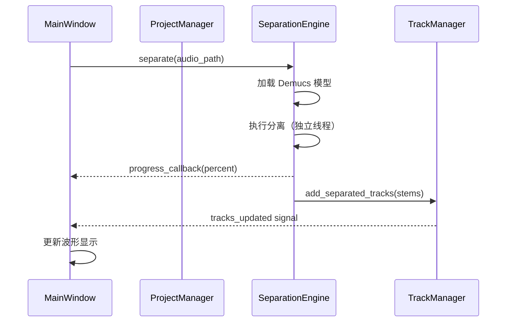
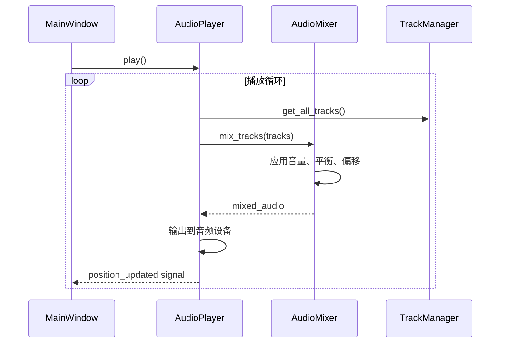
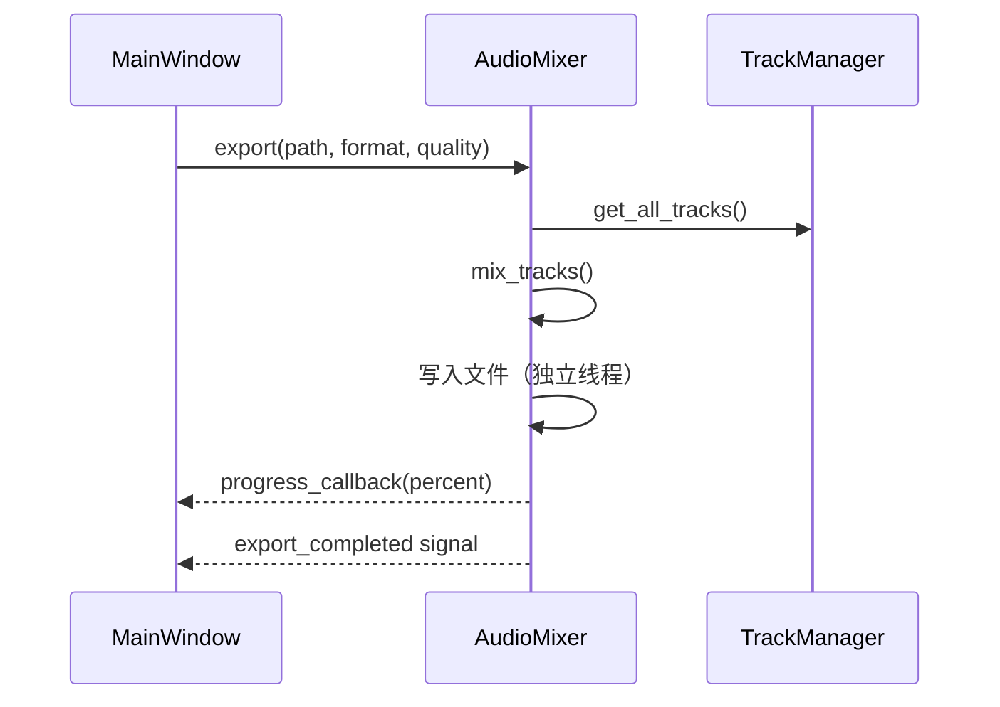

# 设计文档：音频分离和二创工具

## 概述

本文档描述了音频分离和二创工具的技术设计。该工具是一个基于 Python 的桌面应用，使用 Demucs 模型进行音频源分离，提供多轨道波形编辑和混音功能。

**核心功能**：
- 导入音频文件并自动分离为多个音轨（人声、鼓、贝斯、其他）
- 可视化多轨道波形并支持播放控制
- 替换特定音轨并调整音量、平衡、时间偏移
- 导出混合后的音频文件
- 保存和加载编辑项目

**技术栈**：
- **音频分离**：Demucs (demucs)
- **GUI 框架**：PyQt6
- **波形可视化**：PyQtGraph
- **音频处理**：pedalboard, pydub, soundfile, librosa
- **多线程**：QThread

## 架构

### 模块划分

系统采用分层架构，分为以下核心模块：

```
┌─────────────────────────────────────────────────┐
│           GUI Layer (PyQt6)                     │
│  ┌──────────────┐  ┌──────────────────────┐    │
│  │ MainWindow   │  │ WaveformWidget       │    │
│  │ ControlPanel │  │ TrackControlWidget   │    │
│  └──────────────┘  └──────────────────────┘    │
└─────────────────────────────────────────────────┘
                      │
┌─────────────────────────────────────────────────┐
│         Application Layer                       │
│  ┌──────────────┐  ┌──────────────────────┐    │
│  │ ProjectMgr   │  │ TrackManager         │    │
│  └──────────────┘  └──────────────────────┘    │
└─────────────────────────────────────────────────┘
                      │
┌─────────────────────────────────────────────────┐
│         Audio Processing Layer                  │
│  ┌──────────────┐  ┌──────────────────────┐    │
│  │ SeparationEng│  │ AudioMixer           │    │
│  │ AudioPlayer  │  │ EffectsProcessor     │    │
│  └──────────────┘  └──────────────────────┘    │
└─────────────────────────────────────────────────┘
```

### 核心模块

1. **SeparationEngine**：音频分离引擎
   - 加载和管理 Demucs 模型
   - 执行音频源分离
   - GPU/CPU 自动检测和加速

2. **TrackManager**：音轨管理器
   - 管理分离音轨和替换音轨
   - 音轨参数（音量、平衡、偏移）
   - 撤销/重做历史

3. **AudioMixer**：音频混合器
   - 实时混合多个音轨
   - 应用音量、平衡、时间偏移
   - 导出混合音频

4. **AudioPlayer**：音频播放器
   - 播放控制（播放、暂停、停止、跳转）
   - 独奏/静音控制
   - 实时音频输出

5. **WaveformRenderer**：波形渲染器
   - 多轨道波形可视化
   - 缩放和滚动
   - 播放头同步

6. **ProjectManager**：项目管理器
   - 保存/加载项目文件
   - 管理项目元数据
   - 文件路径验证

## 组件和接口

### 1. SeparationEngine

**职责**：执行音频源分离

**关键接口**：
```python
class SeparationEngine:
    def __init__(self, model_name: str = "htdemucs"):
        """初始化分离引擎，加载模型"""
        
    def separate(self, audio_path: str, 
                 progress_callback: Callable[[float], None]) -> Dict[str, np.ndarray]:
        """
        分离音频文件
        返回: {"vocals": array, "drums": array, "bass": array, "other": array}
        """
        
    def cancel(self):
        """取消当前分离操作"""
        
    def get_available_models(self) -> List[str]:
        """获取可用的模型列表"""
```

**实现要点**：
- 使用 `demucs.separate` API 进行分离
- 在独立线程中运行，避免阻塞 UI
- 支持 CUDA/MPS GPU 加速
- 提供进度回调

### 2. TrackManager

**职责**：管理所有音轨及其参数

**数据模型**：
```python
@dataclass
class Track:
    id: str
    name: str
    audio_data: np.ndarray
    sample_rate: int
    track_type: str  # "separated" or "replacement"
    source_type: str  # "vocals", "drums", "bass", "other"
    
    # 可调参数
    volume_db: float = 0.0  # -60 to +12
    pan: float = 0.0  # -1.0 (left) to +1.0 (right)
    time_offset_ms: float = 0.0  # -10000 to +10000
    muted: bool = False
    solo: bool = False
```

**关键接口**：
```python
class TrackManager:
    def add_separated_tracks(self, stems: Dict[str, np.ndarray], sr: int):
        """添加分离后的音轨"""
        
    def add_replacement_track(self, track_id: str, audio_path: str):
        """替换指定音轨"""
        
    def update_track_param(self, track_id: str, param: str, value: Any):
        """更新音轨参数"""
        
    def get_all_tracks(self) -> List[Track]:
        """获取所有音轨"""
        
    def undo(self) / redo(self):
        """撤销/重做操作"""
```

**实现要点**：
- 使用命令模式实现撤销/重做
- 参数变更触发信号通知 UI 更新
- 自动重采样不匹配的音频

### 3. AudioMixer

**职责**：混合多个音轨并导出

**关键接口**：
```python
class AudioMixer:
    def mix_tracks(self, tracks: List[Track]) -> np.ndarray:
        """混合所有启用的音轨"""
        
    def export(self, output_path: str, format: str, 
               quality: str, progress_callback: Callable):
        """导出混合音频"""
        
    def apply_track_effects(self, track: Track) -> np.ndarray:
        """应用音轨效果（音量、平衡、偏移）"""
```

**实现要点**：
- 使用 `pedalboard` 应用音量和平衡
- 使用 `soundfile` 导出音频
- 支持 MP3 (pydub), WAV, FLAC 格式

### 4. AudioPlayer

**职责**：实时播放混合音频

**关键接口**：
```python
class AudioPlayer:
    def play(self):
        """开始播放"""
        
    def pause(self):
        """暂停播放"""
        
    def stop(self):
        """停止播放"""
        
    def seek(self, position_ms: float):
        """跳转到指定位置"""
        
    def get_position(self) -> float:
        """获取当前播放位置（毫秒）"""
```

**实现要点**：
- 使用 `sounddevice` 或 `pyaudio` 进行音频输出
- 在独立线程中运行播放循环
- 实时从 AudioMixer 获取混合音频
- 发射位置更新信号供 UI 同步

### 5. WaveformRenderer

**职责**：渲染多轨道波形

**关键接口**：
```python
class WaveformRenderer:
    def render_waveform(self, audio_data: np.ndarray, 
                       width: int, height: int,
                       start_time: float, end_time: float) -> QPixmap:
        """渲染波形图像"""
        
    def calculate_peaks(self, audio_data: np.ndarray, 
                       num_samples: int) -> np.ndarray:
        """计算波形峰值用于快速渲染"""
```

**实现要点**：
- 使用 PyQtGraph 的 PlotWidget
- 预计算波形峰值数据用于缩放
- 使用 LOD (Level of Detail) 技术优化渲染
- 缓存渲染结果

### 6. ProjectManager

**职责**：保存和加载项目

**项目文件格式** (JSON):
```json
{
  "version": "1.0",
  "original_audio": "path/to/original.mp3",
  "sample_rate": 44100,
  "tracks": [
    {
      "id": "track_001",
      "name": "Vocals",
      "type": "separated",
      "source_type": "vocals",
      "audio_path": "path/to/vocals.wav",
      "volume_db": 0.0,
      "pan": 0.0,
      "time_offset_ms": 0.0,
      "muted": false,
      "solo": false
    }
  ]
}
```

**关键接口**：
```python
class ProjectManager:
    def save_project(self, path: str, tracks: List[Track], metadata: dict):
        """保存项目到文件"""
        
    def load_project(self, path: str) -> Tuple[List[Track], dict]:
        """从文件加载项目"""
        
    def validate_paths(self, project_data: dict) -> List[str]:
        """验证项目中的文件路径，返回缺失的文件列表"""
```

## 数据模型

### Track（音轨）
- **id**: 唯一标识符
- **name**: 显示名称
- **audio_data**: NumPy 数组，音频样本数据
- **sample_rate**: 采样率
- **track_type**: "separated" 或 "replacement"
- **source_type**: "vocals", "drums", "bass", "other"
- **volume_db**: 音量（dB）
- **pan**: 左右平衡
- **time_offset_ms**: 时间偏移（毫秒）
- **muted**: 是否静音
- **solo**: 是否独奏

### Project（项目）
- **version**: 项目文件版本
- **original_audio**: 原始音频文件路径
- **sample_rate**: 项目采样率
- **tracks**: 音轨列表
- **metadata**: 其他元数据（创建时间、修改时间等）

## 数据流

### 音频分离流程



### 音频播放流程



### 音频导出流程



## 错误处理

### 错误类型

1. **文件错误**
   - 文件不存在或无法读取
   - 不支持的音频格式
   - 文件损坏

2. **处理错误**
   - 模型加载失败
   - 内存不足
   - GPU 不可用

3. **导出错误**
   - 磁盘空间不足
   - 写入权限不足

### 错误处理策略

- **用户友好的错误消息**：显示清晰的错误对话框，说明问题和可能的解决方案
- **日志记录**：所有错误记录到日志文件，包含时间戳、堆栈跟踪
- **优雅降级**：GPU 不可用时自动切换到 CPU
- **操作取消**：耗时操作支持用户取消
- **自动恢复**：临时文件损坏时尝试恢复或清理

### 日志系统

使用 Python `logging` 模块：
```python
import logging

logging.basicConfig(
    level=logging.INFO,
    format='%(asctime)s - %(name)s - %(levelname)s - %(message)s',
    handlers=[
        logging.FileHandler('audio_tool.log'),
        logging.StreamHandler()
    ]
)
```

日志级别：
- **DEBUG**: 详细的调试信息
- **INFO**: 一般信息（文件加载、操作完成）
- **WARNING**: 警告信息（GPU 不可用、文件路径缺失）
- **ERROR**: 错误信息（分离失败、导出失败）

## 测试策略

### 为什么不使用属性测试（Property-Based Testing）

本项目**不适合大量属性测试**，原因如下：

1. **主要是集成和 UI 测试**：大部分功能涉及 GUI 渲染、文件 I/O、外部库调用（Demucs、pedalboard），这些不适合 PBT
2. **外部依赖行为**：音频分离、音效处理依赖外部库，我们测试的是集成而非纯函数逻辑
3. **性能和时间约束**：许多需求是性能要求（响应时间、内存使用），不是逻辑正确性
4. **有限的纯逻辑**：少数可能的属性（如序列化往返）相对简单，用单元测试即可充分覆盖

**测试策略**：使用单元测试 + 集成测试 + 性能测试的组合。

### 单元测试

**测试范围**：
- **TrackManager**: 音轨添加、参数更新、撤销/重做
- **AudioMixer**: 音量调整、平衡应用、时间偏移
- **ProjectManager**: 项目保存/加载、路径验证、序列化往返
- **WaveformRenderer**: 峰值计算、波形数据生成

**测试工具**：pytest

**关键测试用例**：

```python
def test_track_volume_adjustment():
    """测试音量调整功能"""
    track = Track(id="t1", audio_data=np.ones(1000), sample_rate=44100)
    mixer = AudioMixer()
    
    track.volume_db = -6.0
    processed = mixer.apply_track_effects(track)
    
    # 验证音量降低约 50%
    assert np.max(processed) < np.max(track.audio_data) * 0.6

def test_project_save_load_roundtrip():
    """测试项目保存和加载往返"""
    tracks = [
        Track(id="t1", name="Vocals", volume_db=-3.0, pan=0.5),
        Track(id="t2", name="Drums", volume_db=0.0, muted=True)
    ]
    pm = ProjectManager()
    
    pm.save_project("test.json", tracks, {"version": "1.0"})
    loaded_tracks, metadata = pm.load_project("test.json")
    
    assert len(loaded_tracks) == len(tracks)
    assert loaded_tracks[0].name == "Vocals"
    assert loaded_tracks[0].volume_db == -3.0
    assert loaded_tracks[1].muted == True

def test_undo_redo_operations():
    """测试撤销/重做功能"""
    tm = TrackManager()
    track = Track(id="t1", name="Test", volume_db=0.0)
    tm.add_track(track)
    
    # 修改音量
    tm.update_track_param("t1", "volume_db", -6.0)
    assert tm.get_track("t1").volume_db == -6.0
    
    # 撤销
    tm.undo()
    assert tm.get_track("t1").volume_db == 0.0
    
    # 重做
    tm.redo()
    assert tm.get_track("t1").volume_db == -6.0

def test_audio_resampling():
    """测试音频重采样"""
    # 创建 48kHz 音频
    audio_48k = np.random.randn(48000)
    
    # 重采样到 44.1kHz
    resampled = resample_audio(audio_48k, 48000, 44100)
    
    # 验证长度正确
    expected_length = int(len(audio_48k) * 44100 / 48000)
    assert abs(len(resampled) - expected_length) <= 1
```

### 集成测试

**测试场景**：
- 完整的音频分离流程（导入 → 分离 → 显示）
- 音轨替换和混音流程
- 项目保存和加载完整性
- 音频播放和导出

### 性能测试

**测试指标**：
- 分离时间（3 分钟音频，GPU vs CPU）
- 内存使用（分离过程、波形渲染）
- UI 响应性（波形渲染帧率）
- 导出速度

**测试方法**：
- 使用 `time.perf_counter()` 测量执行时间
- 使用 `memory_profiler` 监控内存使用
- 使用 `cProfile` 分析性能瓶颈

### UI 测试

**测试工具**：pytest-qt

**测试范围**：
- 按钮点击响应
- 键盘快捷键
- 波形交互（点击、缩放、滚动）
- 对话框显示和交互

## 技术决策

### 为什么选择 Demucs？

- **质量**：Meta 的 Demucs 是目前最先进的音频分离模型之一
- **开源**：MIT 许可证，可自由使用
- **GPU 加速**：支持 CUDA 和 MPS，显著提升速度
- **易用性**：Python API 简单，易于集成

### 为什么选择 PyQt6？

- **成熟稳定**：广泛使用的 GUI 框架
- **功能丰富**：提供完整的 UI 组件和多线程支持
- **跨平台**：支持 Windows、macOS、Linux
- **性能**：C++ 底层，渲染性能优秀

### 为什么选择 PyQtGraph？

- **高性能**：专为科学数据可视化优化
- **实时渲染**：支持大量数据点的实时更新
- **与 PyQt 集成**：无缝集成到 PyQt 应用

### 音频处理库选择

- **pedalboard**：Spotify 开源，高质量音频效果处理
- **soundfile**：快速读写 WAV/FLAC 文件
- **pydub**：简单的 MP3 处理和格式转换
- **librosa**：音频分析和特征提取（如需要）

## 性能优化

### 音频分离优化

- **GPU 加速**：优先使用 CUDA/MPS
- **批处理**：支持批量处理多个文件
- **模型缓存**：首次加载后缓存模型

### 波形渲染优化

- **LOD 技术**：根据缩放级别使用不同精度的波形数据
- **预计算峰值**：缓存波形峰值数据
- **增量渲染**：只重绘变化的区域
- **异步加载**：在后台线程加载波形数据

### 内存优化

- **延迟加载**：只在需要时加载音频数据
- **数据压缩**：使用 float32 而非 float64
- **及时释放**：关闭项目时释放音频数据

### 多线程策略

使用 PyQt6 的 QThread：
- **分离线程**：音频分离在独立线程
- **导出线程**：音频导出在独立线程
- **播放线程**：音频播放在独立线程
- **主线程**：UI 更新和用户交互

**线程通信**：使用 Qt 信号/槽机制

## 部署和打包

### 依赖管理

使用 `requirements.txt`：
```
demucs>=4.0.0
PyQt6>=6.4.0
pyqtgraph>=0.13.0
pedalboard>=0.7.0
pydub>=0.25.0
soundfile>=0.12.0
torch>=2.0.0
numpy>=1.24.0
```

### 打包工具

使用 **PyInstaller** 打包为独立可执行文件：
```bash
pyinstaller --name AudioSeparationTool \
            --windowed \
            --icon=icon.ico \
            --add-data "models:models" \
            main.py
```

### Windows 安装程序

使用 **Inno Setup** 创建安装程序：
- 创建开始菜单快捷方式
- 注册文件关联（可选）
- 卸载支持

## 未来扩展

### 可选功能（P2 优先级）

1. **批量处理**：队列管理多个文件
2. **音效处理**：EQ、混响、压缩器
3. **更多模型**：支持 Spleeter、OpenUnmix
4. **插件系统**：支持第三方音效插件
5. **自动化**：录制和回放操作序列

### 架构扩展点

- **模型接口**：抽象分离引擎，支持多种模型
- **效果链**：可扩展的音效处理管道
- **导出格式**：插件化的导出格式支持
- **主题系统**：可定制的 UI 主题
